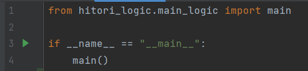

# Хитори

Эта головоломка представляет собой прямоугольную сетку с
размером стороны от 6 до 10 с ячейками, в каждой из которых
находится определенное число.

Задача – закрасить некоторые ячейки так, чтобы в каждом
ряду или колонке ни одно число не повторялось.

Правила хитори:

1. Закрашенные ячейки не могут находиться рядом по горизонтали
   или вертикали, а только по диагонали(если не включенно
   диагональное правило).
2. Остальные (белые) ячейки обязательно должны быть связаны
   друг с другом по горизонтали и вертикали и образовывать при
   этом единую группу.

Код умеет:

1. Генерировать квадратное поле головоломки
2. Решать головомку, как сгенерированную, так и введенную
3. Предоставлять пользователю возможность решать самому
4. Проверять решение пользователя

Запуск программы: в файле main.py запустить функцию main()

## Requirements
* Python 3.11
* Pygame 2.2.1
